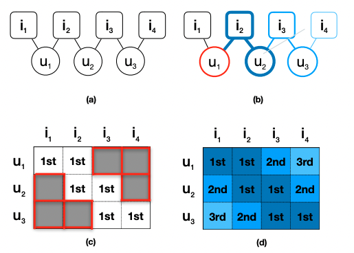
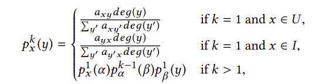

# 進度報告

## Tsung-Hua, Chiang

### 2022-11-29

---

# Git Repo

https://github.com/CTHua/RecSys_CLIP_lab

---

# 實作

- MF
- BPR
- AliasMethod

---

# HOP-REC

## 結合 Latent Factor Model 跟 Graph Based Model

---

---

# Latent Factor Model

- MF
  $$
  \mathcal{L} = \sum_{u, i} c_{ui} (a_{ui} - \theta_u^T \theta_i)^2 + \lambda_{\Theta} \|\Theta\|_2^2;
  $$
- BPR
  $$
  \mathcal{L}_{rank} = \sum_{u, (i, i')} \mathcal{F}(\theta_u^T\theta_{i'}, \theta_u^T \theta_i) + \lambda_{\Theta} \|\Theta\|_2^2,
  $$

## 藉由 user 跟 item 的直接相關性來預測 user 對 item 的喜好程度

$\rightarrow$ 只能預測 user 跟 item 有直接相關性的 item
$\rightarrow$ 把看過與沒看過的 item 列入計算

---

# Graph Based Model

## 藉由 user 跟 item 的間接相關性來預測 user 對 item 的喜好程度

$\rightarrow$ 可以預測 user 跟 item 有間接相關性的 item
$\rightarrow$ 無法把沒看過的 item 列入計算

---

# Real-World Dataset

- 不相關的 item 很多

---

# Assumption

1. 假設 user 沒看過的 item 可以藉由 graph 上的間接相關性來預測
2. 間接相關的喜好程度應該會因 graph 上的距離越遠而越低

---

# HOP-REC

$$
\mathcal{L}_{HOP} = \sum_u \sum_{1 \le k\le K} \overbrace{C(k) \mathbb{E}_{i \sim P_u^k, i' \sim P_N}}^{\text{graph model}} \overbrace{[\mathcal{F}(\theta_u^T\theta_{i'}, \theta_u^T \theta_i) ]}^{\text{factorization model}} + \lambda_{\Theta} \|\Theta\|_2^2,
$$

## 利用 Graph Based Model 去補充 Latent Factor Model 的缺點，增加 postive sample

- Graph Based Model 會有 k-th 相關性，利用這個特點去補充 Latent Factor Model 的缺點 (只有 1-th 相關性)

---

# 作法

1. Positive Sample

- 藉由 Random Walk 去圖上隨機抽樣

- Degree Sampling:

  - 根據 82 法則，多數的 node 的 degree 都會很小，要增加抽到大 degree 的機率
    (演講是說 High degree probability 應該要比較小，這邊是說應該要比較大)
  - vertex 的 degree 越大，被抽到的概率越大
    

- weight 會因為距離越遠而被乘上一個衰減係數（前述的假設 2）
  - $C(k) = \frac{1}{k}$

---

# 作法

2. Negative sampling

- 統一從所有的 item 中抽樣
